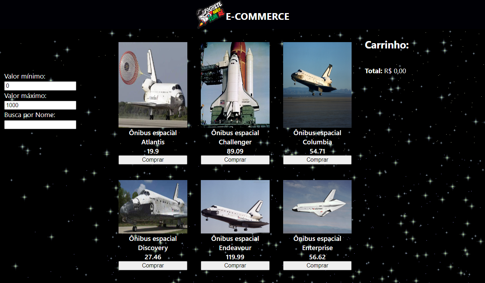

# Labe Commerce

Projeto desenvolvido com React e Styled Componets

## Funcionalidades:

- Adiciona e remove produtos do carrinho;
- Se já existir o produto no carrinho, soma na quantidade;
- Mantém os produtos no carrinho ao atualizar a página;
- Soma todos os produtos do carrinho;
- Filtra lista de produtos por valor mínimo, valor máximo e pelo nome

[Link Surge](http://parched-arm.surge.sh/)

